# 6Pac Visual Reference Pack

## Usage

This file is a visual handoff for design review or an LLM such as Claude. The source PNGs are in [`docs/visual-audit/screens`](./visual-audit/screens/).

Print/share version: [6Pac Visual Reference PDF](./visual-audit/6pac-visual-reference.pdf)  
Browser/print source: [HTML gallery](./visual-audit/6pac-visual-reference.html)

Capture conditions:

- 390 × 844 px viewport;
- dark appearance;
- current repository UI;
- representative local-first fixture data for authenticated product screens;
- real app rendering, not redesigned mockups;
- real unauthenticated sign-up attempt for the auth failure;
- date of capture: 28 June 2026.

The authenticated fixture was necessary because the repository Firebase key was rejected. The fixture was environment-gated and removed after capture. The Friends screen is shown in its genuine cloud-failure state.

## File index

| # | File | Flow/state |
|---:|---|---|
| 00 | `00-login.png` | Login |
| 01 | `01-sign-up.png` | Sign up |
| 02 | `02-onboarding-name.png` | Onboarding: name |
| 03 | `03-onboarding-date-of-birth.png` | Onboarding: DOB |
| 04 | `04-onboarding-biological-sex.png` | Onboarding: sex |
| 05 | `05-onboarding-weight.png` | Onboarding: weight |
| 06 | `06-onboarding-height.png` | Onboarding: height |
| 07 | `07-onboarding-goal.png` | Onboarding: goal |
| 08 | `08-today-dashboard.png` | Today top |
| 09 | `09-today-dashboard-lower.png` | Today lower |
| 10 | `10-nutrition-dashboard.png` | Nutrition |
| 11 | `11-nutrition-add-meal.png` | Add meal |
| 12 | `12-weekly-plan.png` | Weekly Plan top |
| 13 | `13-weekly-plan-schedule.png` | Weekly schedule |
| 14 | `14-weekly-plan-day-picker.png` | Day planning |
| 15 | `15-weekly-targets-edit.png` | Edit weekly targets |
| 16 | `16-workouts-library.png` | Workouts/routines |
| 17 | `17-workout-player-exercise.png` | Workout player |
| 18 | `18-workout-playlist.png` | Live playlist |
| 19 | `19-workout-template-editor.png` | Edit workout |
| 20 | `20-workout-template-new.png` | New workout |
| 21 | `21-profile-hub.png` | Profile top |
| 22 | `22-profile-account-actions.png` | Profile account/actions |
| 23 | `23-progress-dashboard.png` | Progress |
| 24 | `24-body-measurements.png` | Measurements overview |
| 25 | `25-body-measurements-history.png` | Measurements lower/history position |
| 26 | `26-body-measurement-form.png` | Measurement form |
| 27 | `27-exercise-library.png` | Exercise library |
| 28 | `28-exercise-create-form.png` | New exercise |
| 29 | `29-reminders-settings.png` | Reminder settings top |
| 30 | `30-reminders-settings-lower.png` | Reminder settings lower |
| 31 | `31-edit-profile.png` | Edit profile |
| 32 | `32-friends-dashboard.png` | Friends blocking failure |
| 33 | `33-auth-config-failure.png` | Real sign-up configuration failure |

## Authentication and onboarding

### 00 — Login

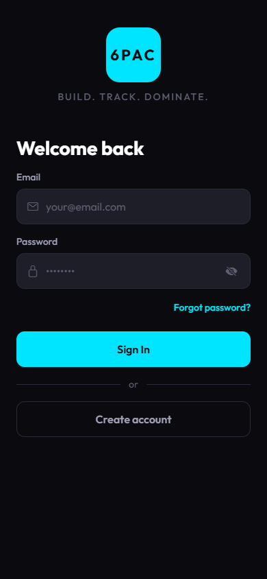

**Observe:** strong visual hierarchy; no Terms/Privacy; cyan primary action; muted labels are low contrast.

### 01 — Sign up

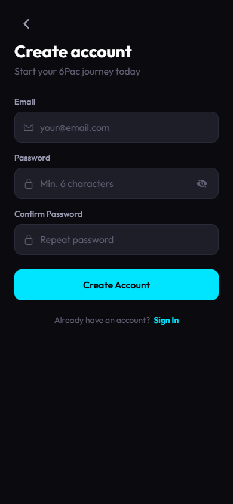

**Observe:** clear three-field form; password rule is mostly placeholder-led; no legal/privacy acknowledgement.

### 02 — Name

### 03 — Date of birth

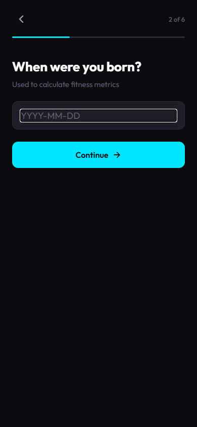

**Observe:** DOB is a text field; rationale is vague.

### 04 — Biological sex

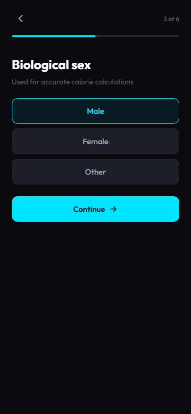

**Observe:** selected default exists before active choice; calculation behavior is not explained.

### 05 — Current weight

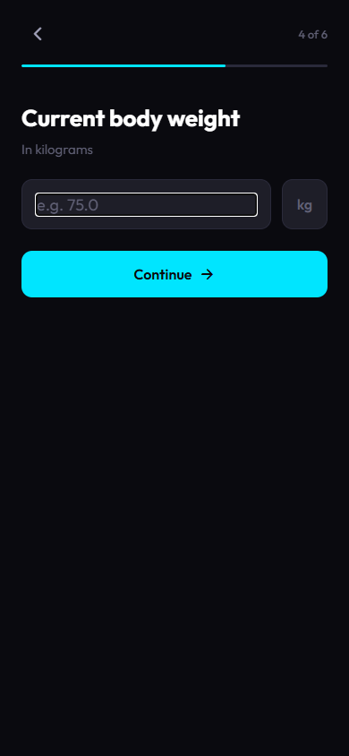

### 06 — Height

**Observe:** fixed metric units with no preference.

### 07 — Goal

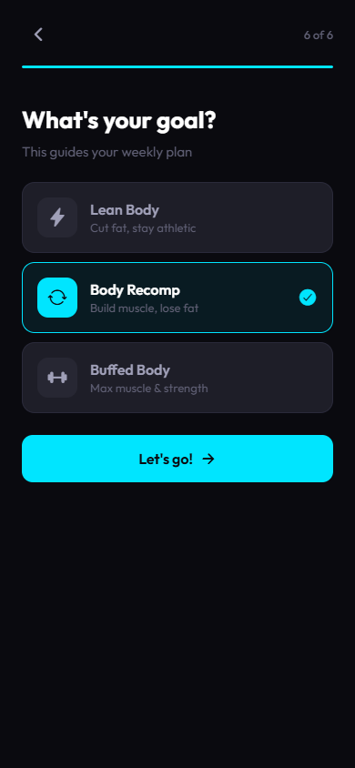

**Observe:** visually clear selection; labels are ambiguous and do not produce a visible plan preview.

## Daily and nutrition

### 08 — Today, first viewport

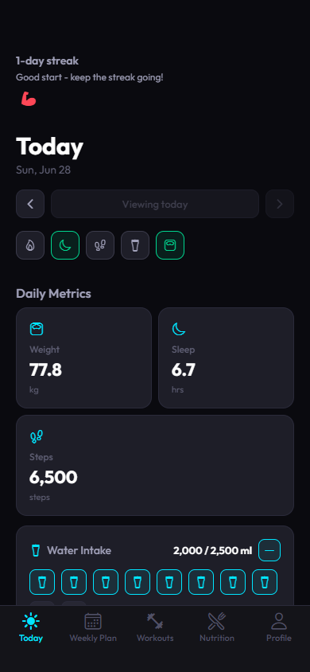

**Observe:** today’s workout and meal action are absent; unlabeled status icons; water begins below fold; streak is a row of identical arm icons.

### 09 — Today, lower content

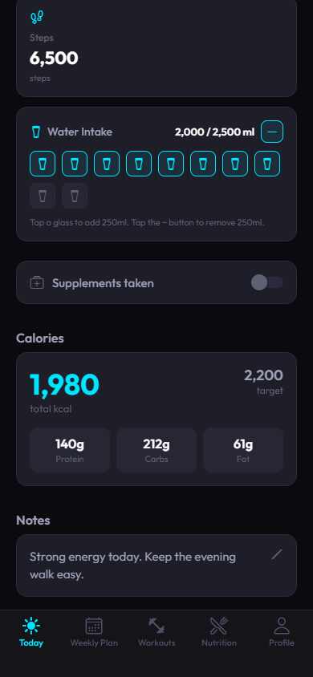

**Observe:** water consumes substantial space; calories/macros and notes are visually clean but far from the top action area.

### 10 — Nutrition

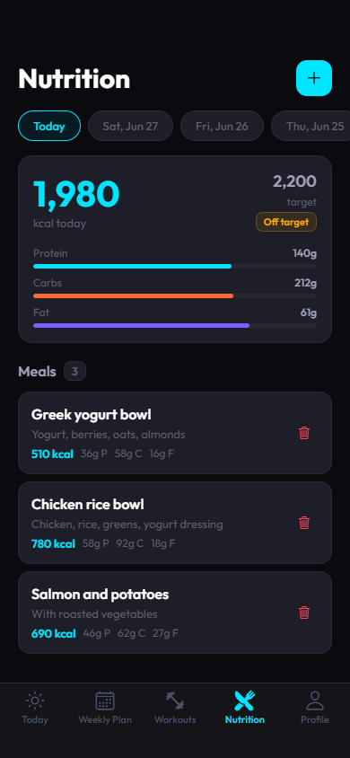

**Observe:** strong compact hierarchy; macro maxima are fixed rather than target-driven; meal data is manually aggregated.

### 11 — Add meal

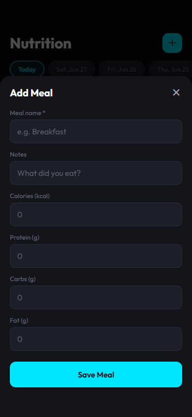

**Observe:** a long total-entry form; no foods, portions, recent meals, recipes, or scan workflow.

## Planning

### 12 — Weekly Plan top

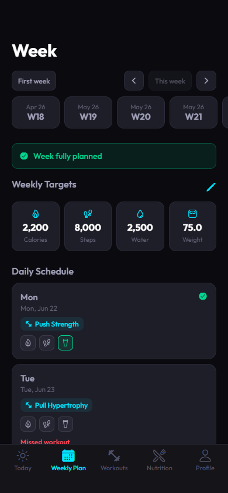

**Observe:** active/current week chip can be outside the visible historical strip; repeated month labels; first day card is large.

### 13 — Weekly schedule

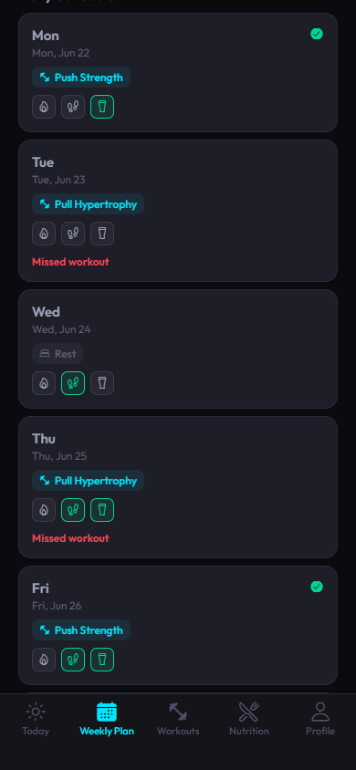

**Observe:** only several days fit; status icons have no labels; “Missed workout” offers no recovery action.

### 14 — Day picker

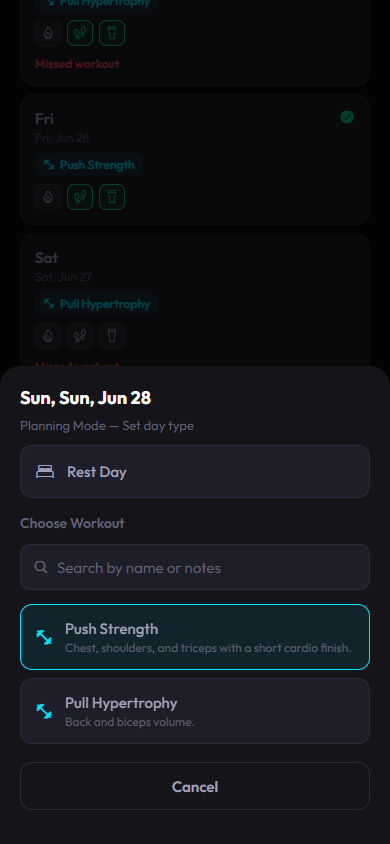

**Observe:** clear modal, but workout choice lacks duration, focus, equipment, and schedule impact.

### 15 — Weekly target editing

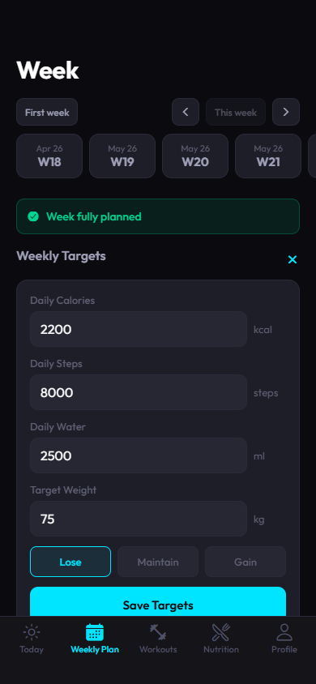

**Observe:** simple free-text targets without recommendations, ranges, protein target, or explanation.

## Training

### 16 — Workouts

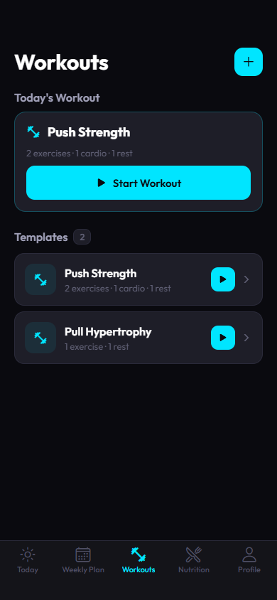

**Observe:** cleanest high-level screen; today’s workout is duplicated in the routine list; quick-play plan semantics are unclear.

### 17 — Workout player

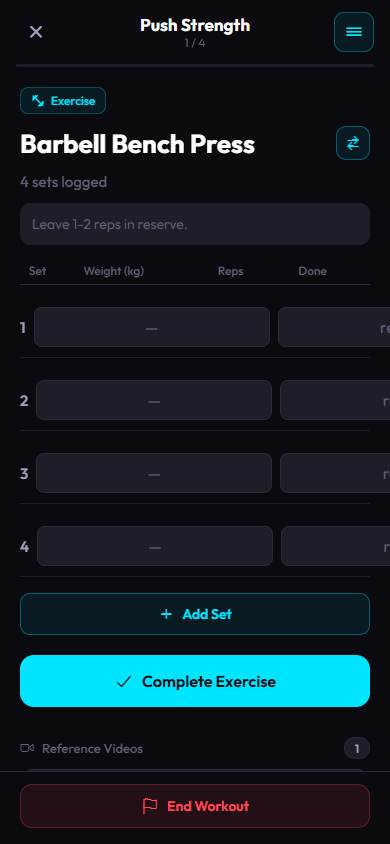

**Critical observation:** reps and completion controls overflow beyond the 390 px viewport. Previous performance and rep target are not shown in the set table.

### 18 — Live workout playlist

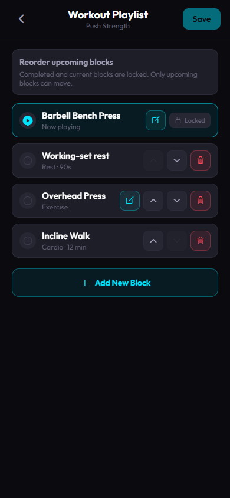

**Observe:** clear current/locked/upcoming structure; dense edit/move/delete controls; “Save” scope is ambiguous.

### 19 — Edit workout

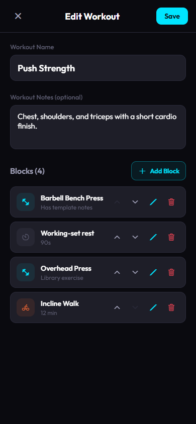

**Observe:** visually strong; block rows omit sets × reps/RIR/rest prescription; private/shared state is not visible.

### 20 — New workout

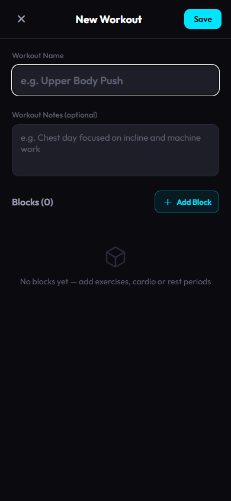

**Observe:** useful empty authoring state; no guided starter routine or plan relationship.

### 27 — Exercise library

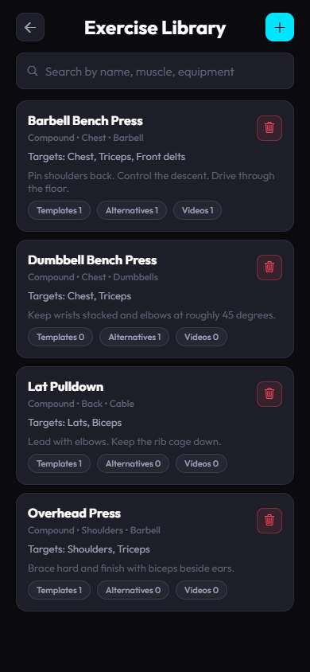

**Observe:** rich information but very tall cards; destructive icon is exposed on every row; no filter controls.

### 28 — New exercise

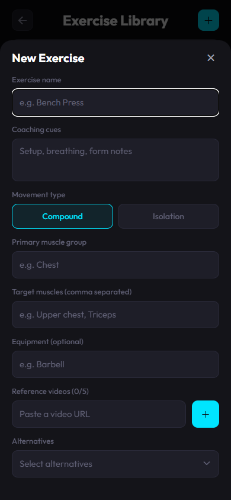

**Observe:** too many fields before first save; muscles/equipment are free text; advanced fields need disclosure.

## Progress and measurements

### 23 — Progress

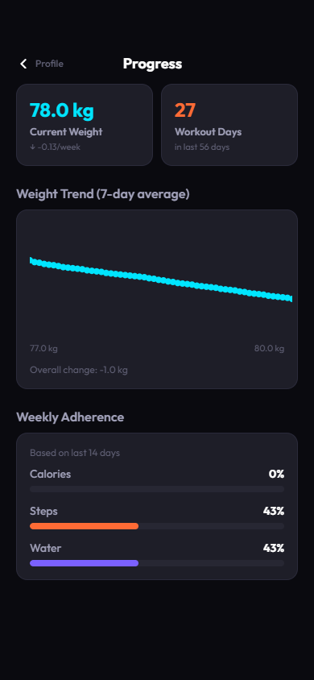

**Observe:** moving-average concept is good; chart lacks date axis and interaction; min/max labels appear where x-axis dates are expected; fixed range; no strength trend.

### 24 — Body measurements overview

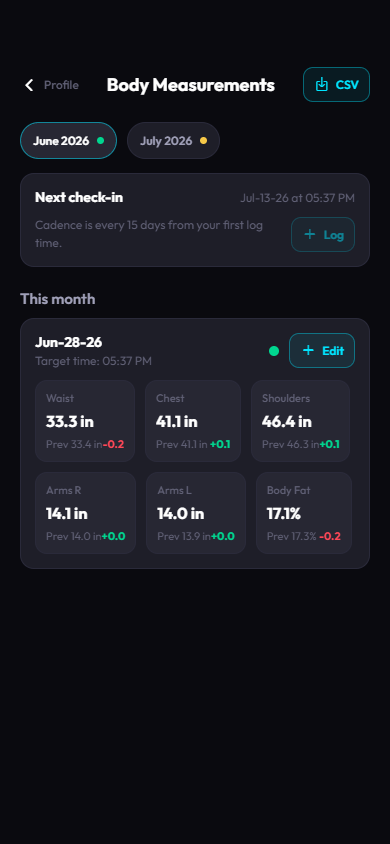

**Observe:** current/previous/delta is useful; cadence and check-in timing are rigid.

### 25 — Body measurements history position

**Observe:** this capture remains visually similar because the selected month has one compact entry; a richer history/trend view is needed.

### 26 — Measurement form

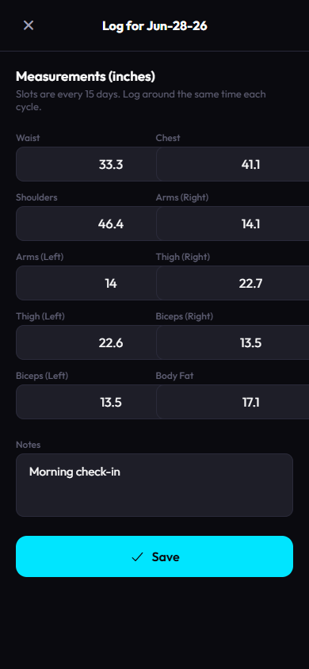

**Observe:** two-column fixed layout, inches only, ambiguous Arms/Biceps terminology, no anatomical measurement help.

## Profile, settings, and system state

### 21 — Profile hub

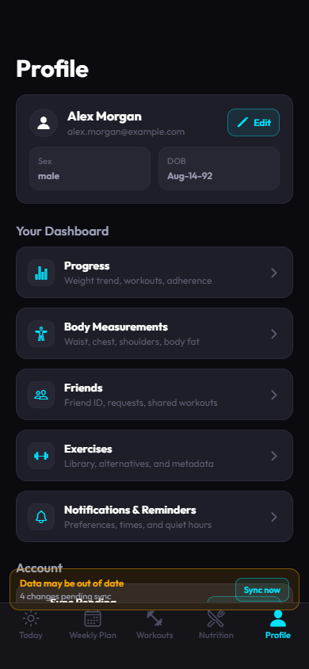

**Critical observation:** sync banner overlays the Account section and bottom navigation. Profile also acts as a catch-all for product areas.

### 22 — Profile lower/account actions

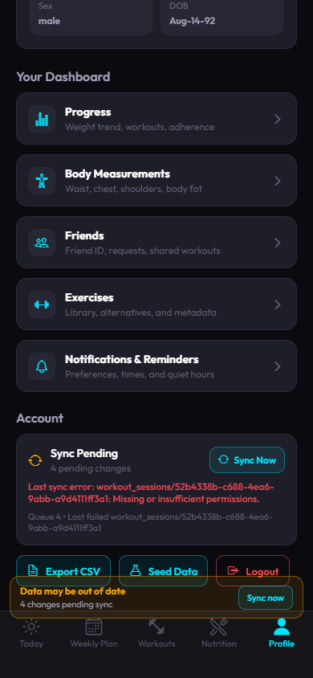

**Observe:** sync/export/seed/logout compete; no privacy, delete account, unit, theme, or connected-app controls.

### 29 — Reminder settings top

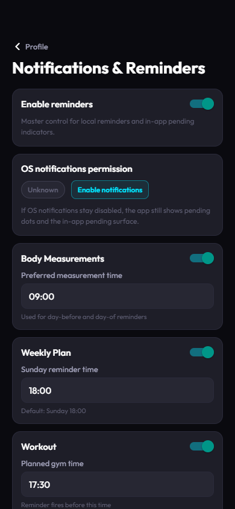

**Observe:** visually coherent but long; raw time text inputs; technical copy; no next-notification preview.

### 30 — Reminder settings lower

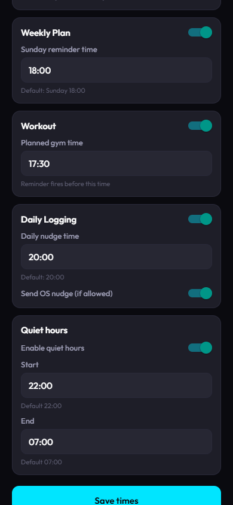

**Observe:** save action is far down the page; native time controls and autosave would reduce errors.

### 31 — Edit profile

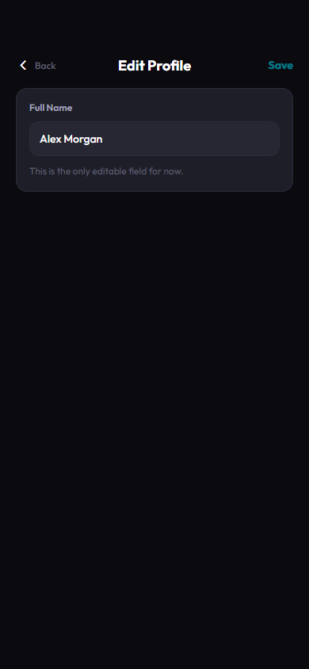

**Observe:** a dedicated screen edits only Full Name, making account/health preferences feel unfinished.

## Blocking failures

### 32 — Friends failure

**Critical observation:** no title, back, retry, cached data, or support action. The user is trapped.

### 33 — Real Firebase sign-up failure

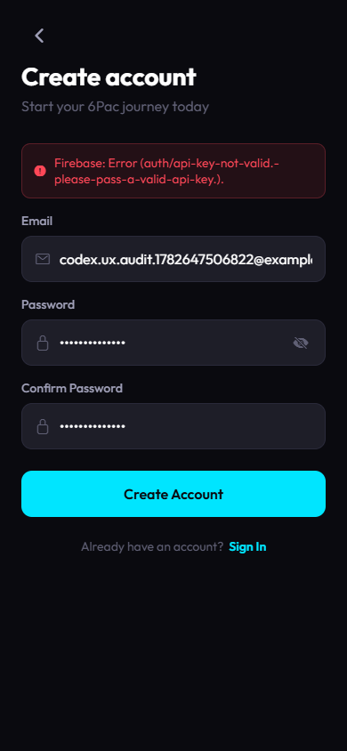

**Critical observation:** the repository configuration produces a raw Firebase “API key not valid” error after submitting sign-up.

## Suggested PDF order

For a concise PDF, use:

1. 00 Login
2. 07 Goal onboarding
3. 08 Today
4. 09 Today lower
5. 12 Weekly Plan
6. 13 Schedule
7. 14 Day picker
8. 16 Workouts
9. 17 Player
10. 18 Playlist
11. 19 Editor
12. 27 Exercise library
13. 10 Nutrition
14. 11 Add meal
15. 23 Progress
16. 24 Measurements
17. 26 Measurement form
18. 21 Profile
19. 29 Reminders
20. 32 Friends failure
21. 33 Auth failure

Use the remaining images as an appendix.
